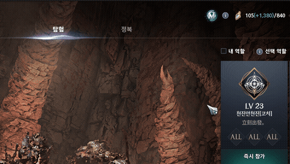
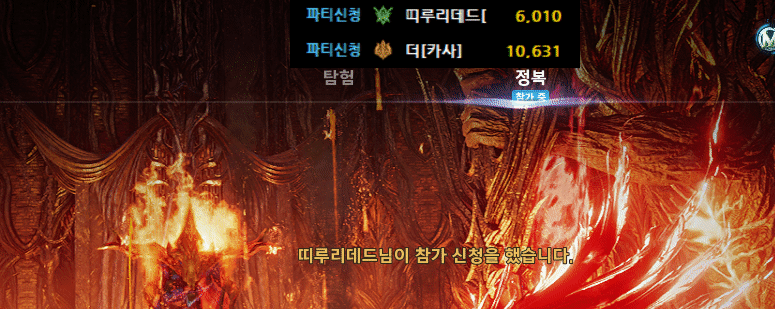

# 아툴조회기 (Atool Viewer)

아이온2 인게임에서 상대 캐릭터의 **[aion2tool](https://www.aion2tool.com) 전투력 점수**를 실시간 오버레이로 표시해주는 도구입니다.

세부정보창을 열면 해당 캐릭터의 전투력 점수를 자동으로 계산하여 게임 화면 위에 띄워줍니다.

aion2tool.com의 전투력 계산식을 프로그램 내에 자체 구현하여 **사이트에 직접 접속하지 않고 로컬에서 즉시 계산**합니다. 덕분에 사이트 접속 지연이나 서버 상태에 영향받지 않아 **조회 속도가 빠르고 안정적**입니다.

## 주요 기능

- 세부정보창 열람 시 캐릭터명/클래스/서버 자동 감지
- aion2tool 전투력 점수 **자체 계산** (사이트 접속 없이 로컬 계산 → 빠르고 안정적)
- ~~전투력 상세 분석 (장비별 기여도, 스탯 브레이크다운)~~
- 오버레이 클릭 시 aion2tool 캐릭터 페이지 바로 열기

### 계산식은 항상 최신 상태

아툴조회기는 프로그램을 실행할 때마다 aion2tool.com에서 **최신 계산식을 자동으로 받아옵니다.** 따라서 aion2tool 사이트에서 계산식이 변경되더라도 별도의 업데이트 없이 항상 최신 계산 결과를 보여줍니다.

(인터넷 연결이 불가능한 경우에만 마지막으로 받아둔 계산식을 사용합니다.)

---

## 설치 방법

### 1단계: Npcap 설치 (필수)

아툴조회기는 네트워크 패킷 캡처를 위해 **Npcap**이 반드시 필요합니다.

1. **Npcap 다운로드**
   - https://npcap.com/#download 에서 **Npcap Installer** 다운로드

2. **설치 실행**
   - 다운로드한 `npcap-x.xx.exe` 실행 (관리자 권한 필요)

3. **설치 옵션 설정** (중요!)
   - 설치 중 옵션 선택 화면이 나타나면 다음과 같이 체크합니다:

   | 옵션 | 체크 여부 | 설명 |
   |------|-----------|------|
   | Install Npcap in WinPcap API-compatible Mode | **체크** | 호환성 모드 - 반드시 필요 |
   | Support loopback traffic ("Npcap Loopback Adapter") | **체크** | VPN/가속기 사용자는 반드시 필요 |
   | Restrict Npcap driver's access to Administrators only | 체크 해제 | 체크하면 관리자 외 실행 불가 |

   > **VPN 또는 게임 가속기**(ExitLag, Mudfish 등)를 사용하는 경우, "Support loopback traffic" 옵션을 반드시 체크해야 합니다. 이 옵션 없이는 패킷이 캡처되지 않을 수 있습니다.

4. **설치 완료** 후 PC 재부팅 권장

### 2단계: 아툴조회기 다운로드

1. [Releases 페이지](../../releases)에서 최신 버전의 `AtoolViewer.exe` 다운로드
2. 원하는 폴더에 저장

### 3단계: 관리자 권한으로 실행

패킷 캡처를 위해 **관리자 권한**이 필요합니다.

- `AtoolViewer.exe`를 **우클릭** → **관리자 권한으로 실행**

> 매번 우클릭이 번거롭다면:
> 1. `AtoolViewer.exe` 우클릭 → **속성**
> 2. **호환성** 탭 → **"관리자 권한으로 이 프로그램 실행"** 체크 → 확인

---

## 사용법

### 기본 사용

> **필수**: 아이온2 게임 설정에서 화면 모드를 **"창 모드"** 또는 **"전체 창 모드"**로 설정해야 오버레이가 정상적으로 표시됩니다. 전체 화면(독점 풀스크린) 모드에서는 오버레이가 보이지 않습니다.

1. 아이온2 게임 접속
2. 아툴조회기를 관리자 권한으로 실행 (게임이 먼저 실행되어 있어야 포트가 자동 감지됩니다)
3. 인게임에서 다른 캐릭터의 **세부정보창**을 열면 자동으로 전투력 점수가 오버레이로 표시됨
4. 오버레이를 **클릭**하면 해당 캐릭터의 aion2tool 페이지가 브라우저에서 열림
5. **ESC** 키로 오버레이 닫기



### 내 캐릭터 전투력 조회

- **Ctrl + `** (백틱) 키를 누르면 내 캐릭터의 전투력 점수를 조회합니다.
- "내 캐릭터 정보 없음"이라고 나올 경우, 키벨로 맵 이동을 하거나 캐릭터 선택창에 나갔다 오면 정보가 잡힙니다.

### 파티 신청자 전투력 자동 표시

- 원정대, 초월 등에서 **파장(파티장)**일 때, 파티 신청자의 아툴 점수가 자동으로 오버레이에 표시됩니다.



---

## 문제 해결

### 캐릭터는 감지되는데 전투력이 표시되지 않는 경우

`system.log`에 아래와 같은 오류가 있다면 **Visual C++ 재배포 패키지**가 설치되어 있지 않은 것입니다.

```
[melly] 초기화 실패: [WinError -529697949] Windows Error 0xe06d7363
```

**해결 방법:** [Microsoft Visual C++ Redistributable (x64)](https://aka.ms/vs/17/release/vc_redist.x64.exe) 를 설치한 후 프로그램을 다시 실행하세요.

### 아무것도 감지되지 않는 경우

`system.log`에서 아래 항목을 확인하세요:

- `[게임] 게임 창 미감지` → **아이온2를 먼저 실행**한 후 아툴조회기를 실행하세요.
- `패킷=0` → Npcap이 정상 설치되었는지 확인하세요. 백신/방화벽이 차단하고 있을 수 있습니다.
- `게임포트=0` → 포트가 잘못 감지된 경우입니다. 게임을 먼저 실행한 상태에서 아툴조회기를 재시작하세요.

---

## ⚠️ 면책 조항

본 프로그램은 개인이 개발한 비공식 툴입니다.
사용으로 인해 발생하는 문제에 대해
개발자 및 배포자는 어떠한 책임도 지지 않습니다.
반드시 개인적인 참고용으로만 조용히 사용하시기 바랍니다.

---

## 🛡️ 안전성 및 제재 주의사항 (필독)

본 프로그램은 윈도우 PC에서 네트워크 패킷을 직접 캡처(Sniffing) 하는 방식으로 동작합니다.
이 과정에서 게임과 함께 실행되는 보안 프로그램(안티치트, XIGNCODE 등) 에 의해
비인가 외부 프로그램으로 인식될 가능성이 존재합니다.

---

## 💬 문의

디스코드: https://discord.gg/bHnuCH4jR5
